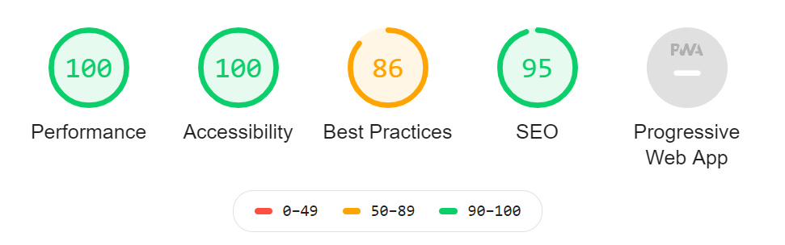
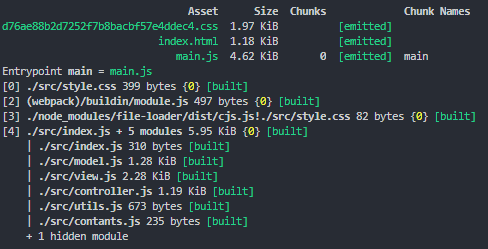

A few words about my implementation:

# ENVIRONMENT

I installed only dev dependencies to improve developer experience and code quality.
Added some hooks like pre-commit, pre-push to prettify/eslint changes and run tests(in jest)
Added eslint plugins to keep web standards, catch bugs in IDE.

# CODE

HTML: In html file I added template with controls to filter/sort articles and entry point for article feed. HTML code uses semantic tags. Improved seo by include simple meta tags

CSS: I added simply css file with rwd layout styles done via CSS GRID

JS: To not overcomplicate things and keep bundle size small I built small mvc with only javascript, not with react etc.
I preferred function compositions without classes and this/new fatigue.
My modules are factory functions with private members and frozen return value to add a bit immutability.
Code is relative easy to test: I use async/await syntax, array fp methods like map/filter/reduce.

# AUDITS

in /audits folder

I did two simple audits about bundle sizes and website performance/seo/accessibility via WEBPACK-BUNDLE-ANALYZER and LIGHTHOUSE CI

Code bundle is very small and lighthouse audits pretty high - adding favicon and http/2 increase best practises

# IMPROVEMENTS

1. Sorting and maping to unixDate is a bit primitive because it only support one language - pick date library with multi languages support
2. Add pretty styles to interface
3. Improve view module, add template functions
4. Add service workers and cache some resources, make this app PWA
5. Use HTTP/2 for all of its resources
6. Write more tests, including some e2e like cypress
